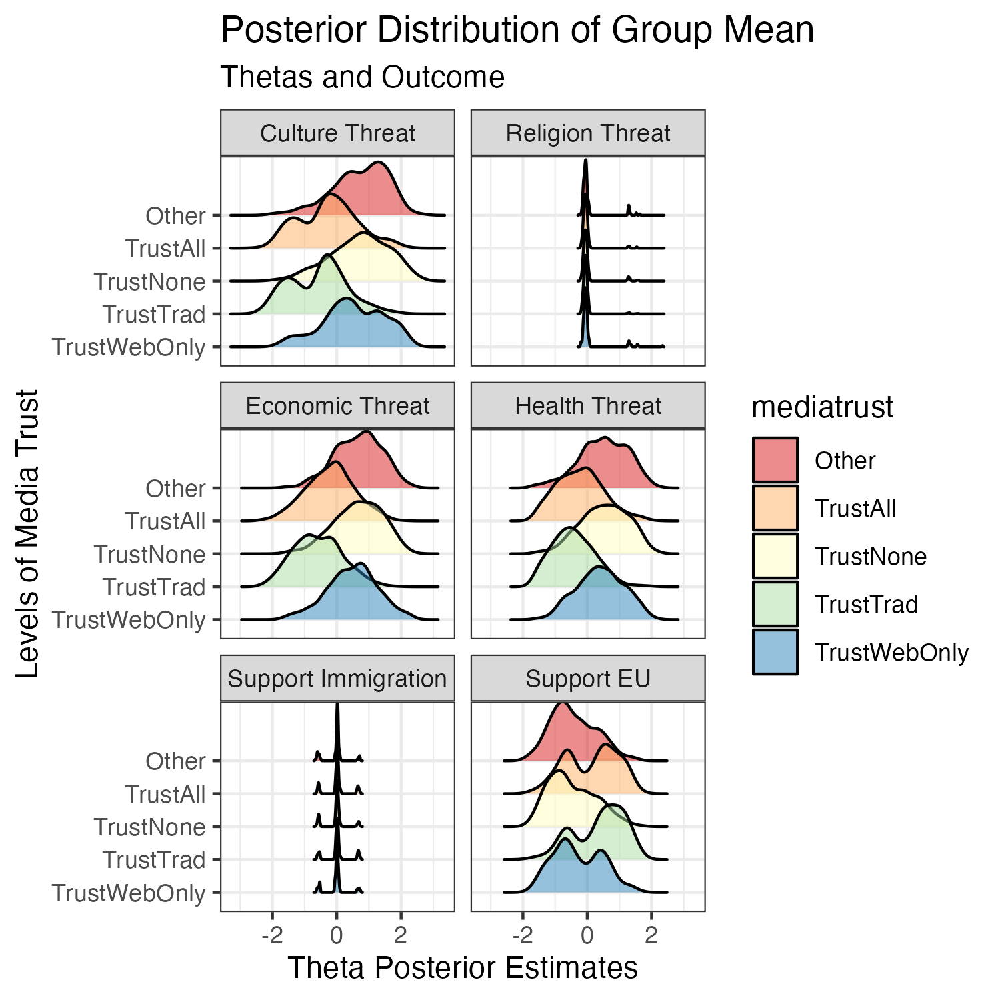

# IRTM-Synth 

Welcome to the IRT-M Synth repository! This is an R and Python repository to create realistic synthetic survey datasets for research and testing purposes.

## Overview:

With this repository, we address a problem endemic to producing example data for new methods and utilities. On the one hand, as social scientists, we understand the expense and labor involved in creating original survey datasets. Data is not free to produce, so originators often (justifiably!) want to control the release and distribution of their data.

Conversely, as methodologists, we also understand that new tools require applied examples. New packages and applications need to include data in vignettes.

Here, we create synthetic versions of existing data to serve as training examples, with references and links to the original datasets so that researchers and users can use (and credit) the original data in their applications.

## Data

The scripts are currently set up to create a synthetic sample of Eurobarometer 94.3 (2021). The original data can be accessed via: https://search.gesis.org/research_data/ZA7780?doi=10.4232/1.14076

## Features:

We use Python in a Jupyter Project for data preparation, [YData-synthetic](https://github.com/ydataai/ydata-synthetic) in a Google Colab notebook to create the synthetic data.
The synthetic data is incorporated into a package vignette via an Rmarkdown script.

## Contact

For any questions, suggestions, or feedback, please don't hesitate to contact us at margaret.foster@duke.edu.
